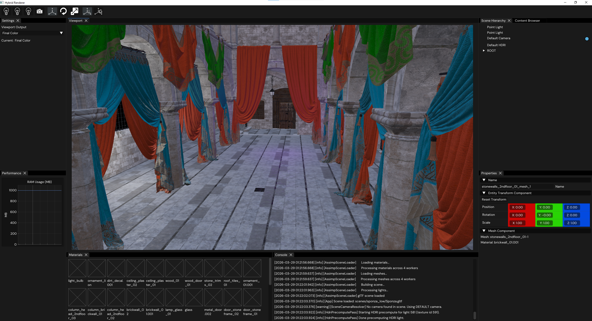
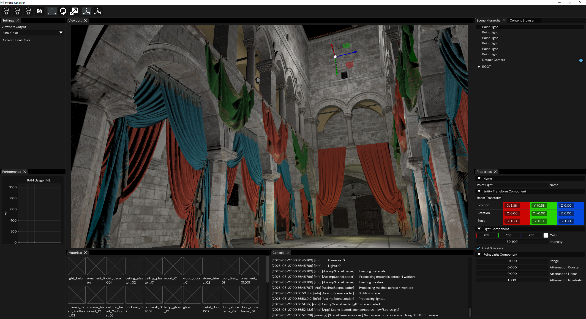
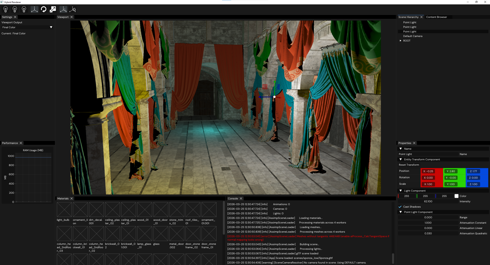
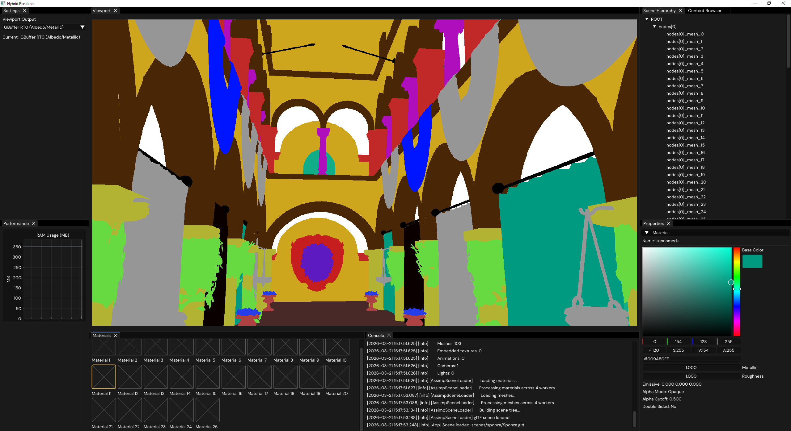
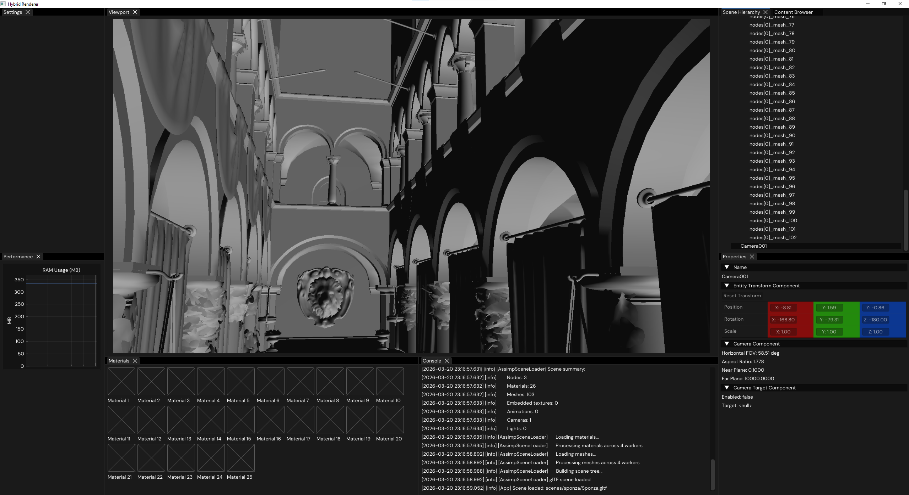
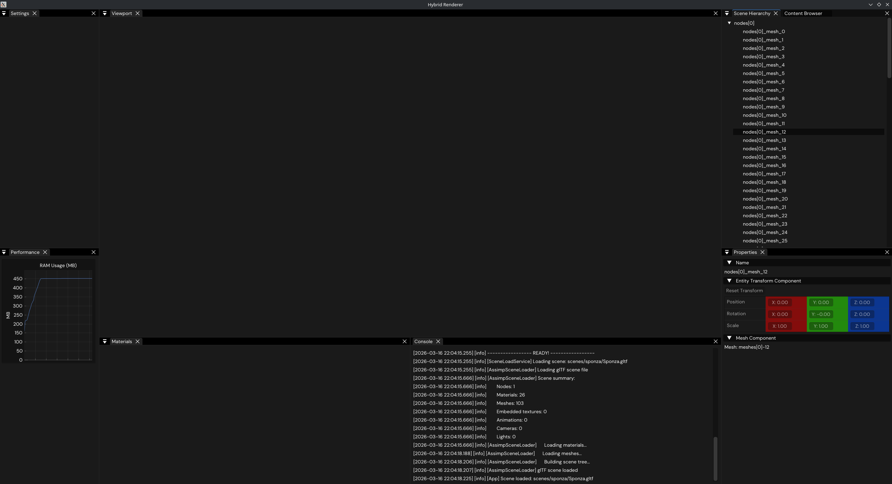

# Hybrid Rendering Engine

## Introduction

## Getting started

Clone this repo:
- `git clone --recurse-submodules https://github.com/VladChira/hybrid-renderer.git`

### Build (Linux)

Install GCC, plus Ninja and vcpkg, then:
- `export VCPKG_ROOT=/path/to/vcpkg`
- `cmake --preset linux-ninja`
- `cmake --build --preset linux-ninja`

### Build (Windows)

Install:
- Visual Studio 2022 (or Build Tools) with “Desktop development with C++” (MSVC + Windows SDK)
- Ninja
- vcpkg + `VCPKG_ROOT` set to your vcpkg ports repo

Use the “x64 Native Tools Command Prompt for VS 2022” (or otherwise ensure the x64 MSVC environment is active), then:
- `set VCPKG_ROOT=C:\\path\\to\\vcpkg`
- `cmake --preset win-ninja`
- `cmake --build --preset win-ninja`

## Progress images

Diffuse HDRI

Metallic, roughness and normal mapping

Deferred shading, UI updates

G-Buffer Pass (albedo on screen), material updating

Simple visualisation, materials panel, cameras

Scene loading and hierarchy

UI Scaffold
